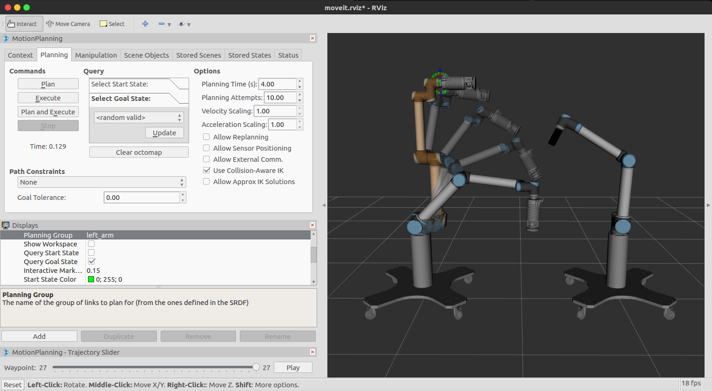
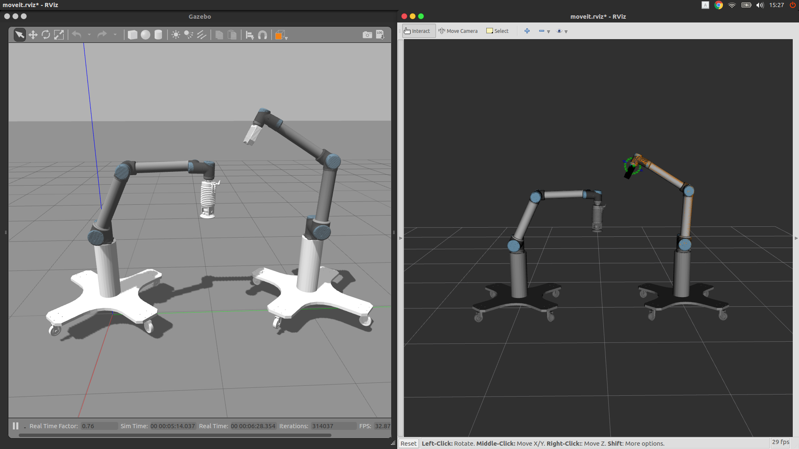
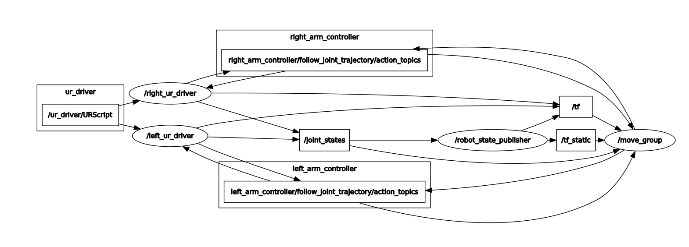

# dual_ur双机械臂控制程序介绍

[TOC]

## 一、简介

本系统使用ros控制双机械臂系统，实现了双机械臂的Gazebo仿真，以及连接并控制两台真实的UR10机器人。

## 二、Packages

### 1. dual_ur_description

`dual_ur_description`包是双机械臂系统的描述文件。包括urdf描述文件、meshes模型文件。以下是关键文件介绍：

+ `dual_ur10_robot.urdf.xacro`：双机械臂的描述文件。

+ `dual_ur10_joint_limited_robot.urdf.xacro`：带有关节限制的双机械臂的描述文件。

+ `dual_ur_upload.launch`：机械臂描述文件的加载程序，默认将无关节限制的描述文件加载到参数服务器的`robot_description`下，可以通过传入参数`limited:=true`更改默认行为。

+ `display.launch`：机器人模型的显示程序，通过运行以下命令可以在`rviz`中显示机器人模型，方括号内容可选。

  ```shell
  roslaunch dual_ur_description display.launch [limited:=true]
  ```

### 2. dual_ur_moveit_config

`dual_ur_moveit_config`是双机械臂的`moveit!`配置包，包含了进行运动规划所需的文件。

**config/：**

+ `controllers.yaml`：`moveit!`路径规划控制器的配置文件，表明运行`moveit!`时`move_group`节点会订阅`left(right)_arm_controller/follow_joint_trajectory`动作话题，**注意保持前后一致**。
+ `dual_ur.srdf`：双机械臂模型结构的语义信息，记录了使用`moveit_assistant`进行的设置。一旦更改了机器人的模型，如添加末端抓手，就要重新调用`moveit_assistant`更新碰撞检测矩阵。

**launch/:**

+ `dual_ur_moveit_planning_execution.launch`：`moveit!`规划器的启动程序。实际上就是设置`limited`参数后再调用`move_group.launch`，因此以下两条命令等价：

  ```shell
  roslaunch dual_ur_moveit_config dual_ur_moveit_planning_execution.launch [limited:=true]
  roslaunch dual_ur_moveit_config move_group.launch [limited:=true]
  ```

+ `move_group.launch`：运动规划最重要的节点`move_group`的启动程序。它的调用层次结构如下图。首先调用一系列launch文件加载运动规划所需的配置文件，最后启动move_group节点。

  ```mermaid
  graph TD
  	aa(dual_ur_moveit_planning_execution.launch)-->a
  	a(move_group.launch)-->b(planning_context.<br/>launch)
  	a-->c(planning_pipeline.<br/>launch.xml)
  	a-->d(trajectory_execution.<br/>launch.xml)
  	a-->e(sensor_manager.<br/>launch.xml)
  	b-->b1(load<br/>dual_ur10<_joint_limited>_<br/>robot.urdf.xacro,<br/>dual_ur.srdf,<br/>joint_limits.yaml,<br/>kinematics.yaml)
  	c-->c1(ompl_planning_<br/>pipeline.launch.xml)
  	c1-->c11(load<br/>ompl_planning.yaml)
  	d-->d1(dual_ur_moveit_<br/>controller_manager.<br/>launch.xml)
  	d1-->d11(load<br/>controllers.yaml)
  	e-->e1(dual_ur_moveit_<br/>sensor_manager.<br/>launch.xml)
  	e1-->e11(load<br/>sensors.yaml)
  	b1-->z
  	c11-->z
  	d11-->z
  	e11-->z
  	z(run<br/>move_group)
  	style b1 fill:#eea,stroke:#331,stroke-width:1px;
  	style c11 fill:#eea,stroke:#331,stroke-width:1px;
  	style d11 fill:#eea,stroke:#331,stroke-width:1px;
  	style e11 fill:#eea,stroke:#331,stroke-width:1px;
  	style z fill:#eee,stroke:#331,stroke-width:1px;
  ```

+ `moveit_rviz.launch`：启动rviz可视化运动规划。

  

+ `demo.launch`：模拟的运动规划演示程序。

### 3. dual_ur_gazebo

`dual_ur_gazebo`是双机械臂进行`Gazebo`仿真的配置包。

+ `arm_contoller_dual_ur.yaml`：仿真的控制器设置文件。要保证控制器的名字与 `dual_ur_moveit_config/controllers.yaml`中的设置一致，这样才可以发布能被`move_group`正确订阅的`action`。

+ `dual_ur.launch`：仿真器的启动文件。它首先会调用`dual_ur_description/dual_ur_upload.launch`加载机器人的描述文件。使用时传入`limited:=true`参数选择使用有关节限制的模型。

  ```mermaid
  graph TD
  	a(dual_ur.launch)-->b(gazebo_ros/<br/>empty_world.launch)
  	a-->c(dual_ur_upload<br/>.launch)
  	b-->d(run<br/>spawn_model)
  	c-->d
  	a-->e(controller_utils.launch)
  	e-->e1(run<br/>robot_state_<br/>publisher)
  	e-->e2(load<br/>joint_state_<br/>controller.yaml)
  	e2-->e21(run<br/>joint_state_<br/>controller_spawner)
  	a-->f(load<br/>arm_controller_dual_ur.yaml)
  	f-->f1(run<br/>left_arm_controller_spawner<br/>right_arm_controller_spawner)
  	style f fill:#eea,stroke:#331,stroke-width:1px;
	style e2 fill:#eea,stroke:#331,stroke-width:1px;
  	style e1 fill:#eee,stroke:#331,stroke-width:1px;
  	style f1 fill:#eee,stroke:#331,stroke-width:1px;
  	style e21 fill:#eee,stroke:#331,stroke-width:1px;
  	style d fill:#eee,stroke:#331,stroke-width:1px;
  ```

### 4. ur_modern_driver

`ur_modern_driver`是真实机器人的驱动包，负责与真实的机械臂建立连接，并提供接口给`moveit!`。

+ `dual_ur_bringup.launch`：与两台UR10建立连接的驱动程序。主要内容为启动两个`ur_driver`节点，分别驱动两个ur10机械臂。需要**注意**的是，在每个节点启动时，要将控制器动作（`action`）话题 `remap`到`dual_ur_moveit_config/controllers.yaml`中设置的控制器动作话题中，例如：

  ```xml
  <node name="left_ur_driver" pkg="ur_modern_driver" type="ur_driver" output="screen">
       <remap from="/follow_joint_trajectory" to="/left_arm_controller/follow_joint_trajectory"/> 
  </node>
  ```

  其次，因为要建立TCP/IP连接，所以需要将两台机器人和电脑连入同一局域网下，并且设置ip地址，注意电脑两台机器人的通信的端口号要不同，这些参数在文件开头即可设置：

  ```xml
   <!-- 驱动器参数 -->
   <arg default="left_" name="left_prefix"/>
   <arg default="right_" name="right_prefix"/>
   <arg default="192.168.1.102" name="left_robot_ip"/>        
   <arg default="192.168.1.103" name="right_robot_ip"/>
   <arg default="192.168.1.2" name="reverse_ip"/>
   <arg default="50001" name="left_reverse_port"/>
   <arg default="50002" name="right_reverse_port"/>
  ```

  另外，也可以传入`limited`参数决定是否使用限制关节的模型，默认为`true`。

## 三、使用

### 1. 使用Gazebo仿真

依次运行以下命令，接着即可使用`rviz`的可视化界面进行运动规划仿真。

```shell
# 启动Gazebo仿真器
roslaunch dual_ur_gazebo dual_ur.launch limited:=true
# 启动move_group
roslaunch dual_ur_moveit_config dual_ur_moveit_planning_execution.launch limited:=true
# 启动rviz可视化运动规划
roslaunch dual_ur_moveit_config moveit_rviz.launch 
```



### 2. 使用真实机器人

依次运行以下命令，接着即可使用`rviz`的可视化界面控制真实的双UR10机械臂系统。

```shell
# 与双机械臂建立连接
roslaunch ur_modern_driver dual_ur_bringup.launch 
# 启动move_group
roslaunch dual_ur_moveit_config dual_ur_moveit_planning_execution.launch limited:=true
# 启动rviz可视化运动规划
roslaunch dual_ur_moveit_config moveit_rviz.launch 
```

启动顺利的节点图：



rviz可视化界面与真实机器人：

<figure class="half">
    
    
</figure>


